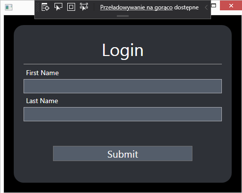
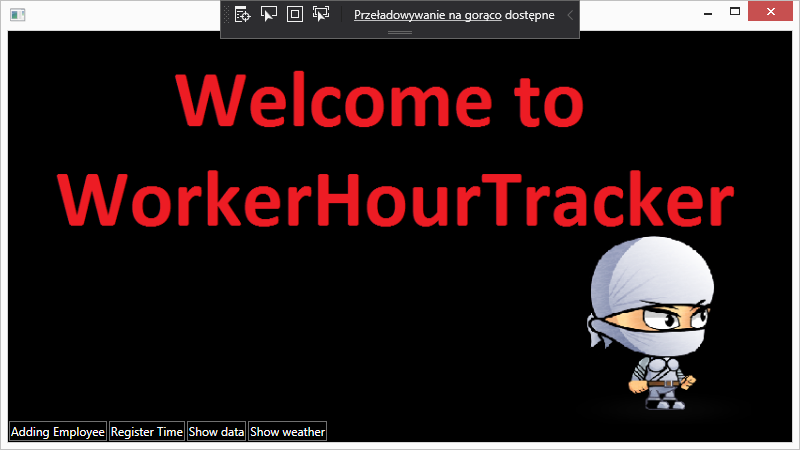
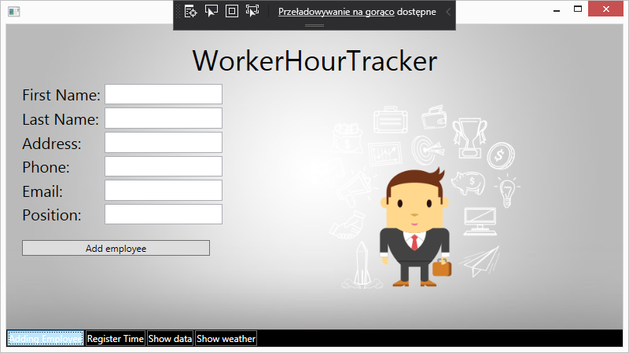
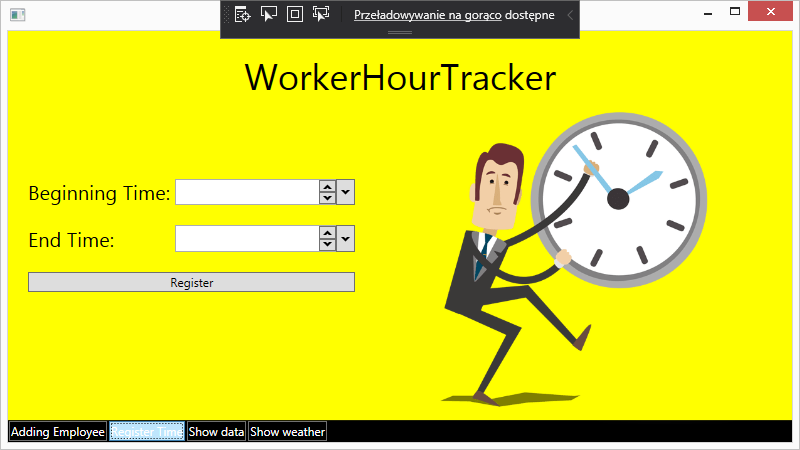
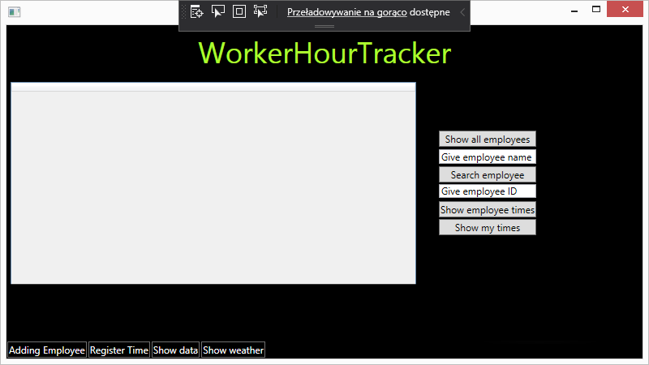
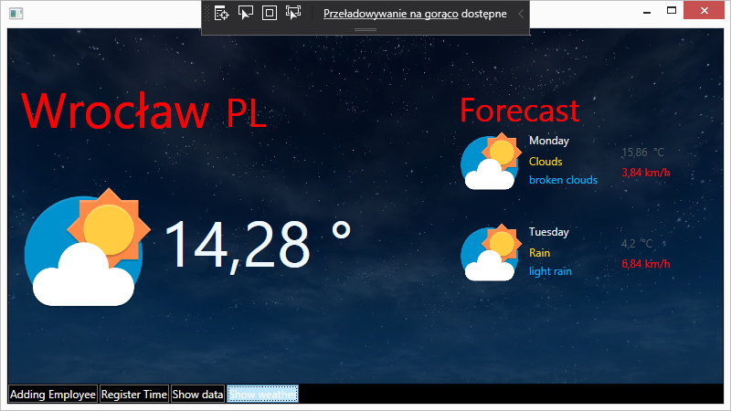

# WorkerHourTracker

WorkerHourTracker is simple app written in C#.Net with WPF using Oracle database. It enables employee management by providing such functions as: adding employee to database, registering their time spend working, viewing all statisctics for each employee. It also has weather view with current temperature in choosen city and forecast for next 2 days, because it is always ussefull addition to check weather in application :). 

## Technologies
* .NET Core
* Oracle SQL

## Packages 
* Extended.Wpf.Toolkit
* log4net
* Microsoft.EntityFrameworkCore.Tools
* Newtonsoft.Json
* Oracle.EntityFrameworkCore 

## API
[OpenWeather](https://openweathermap.org/api)

## Installation and configuration 
```git
git clone https://github.com/maciekpop/dotNetJava.git 
cd dotNetJava/
open app
```
* install Oracle database on your local computer
* create new database and configurate ConnectionString in EmploeeContext.cs file
* update database
* run application

## Views from app







## Authors:
* Robert Krzyżoś [@Github](https://github.com/CrossAxis98)
* Maciej Popieluch [@Github](https://github.com/maciekpop)
