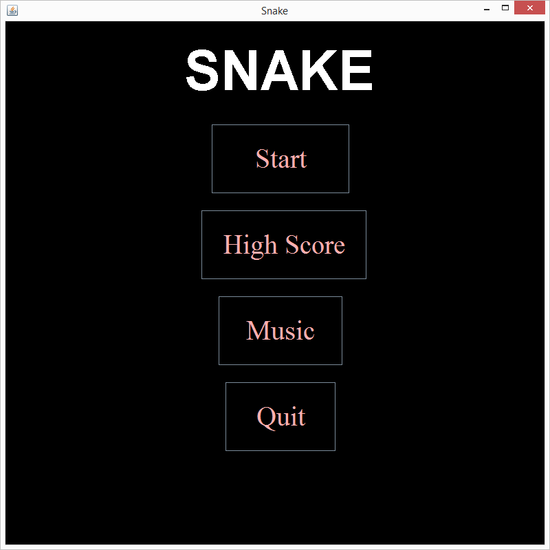
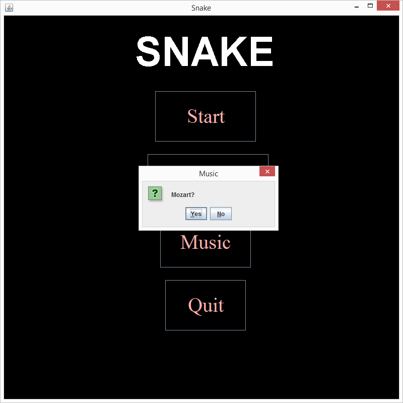
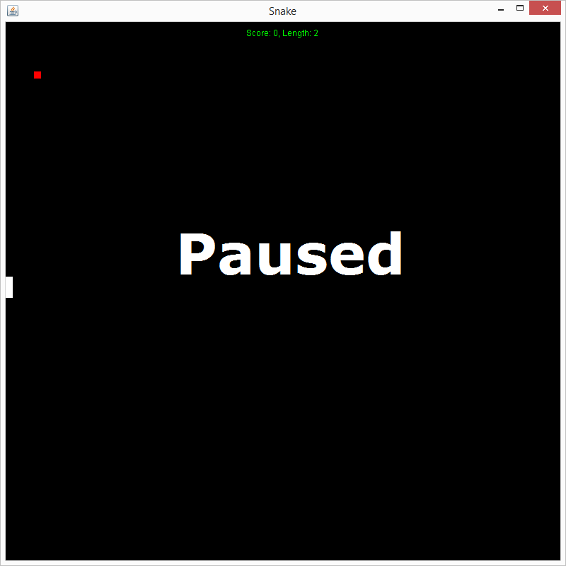
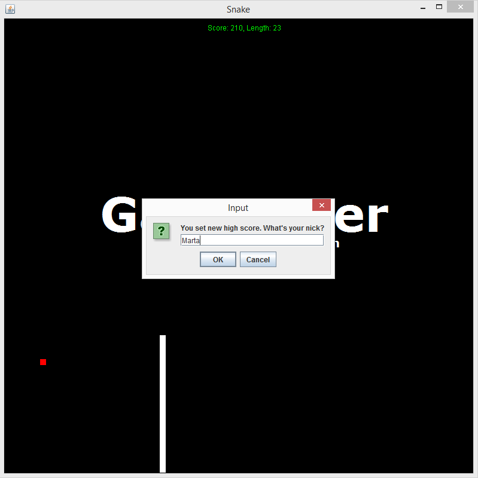
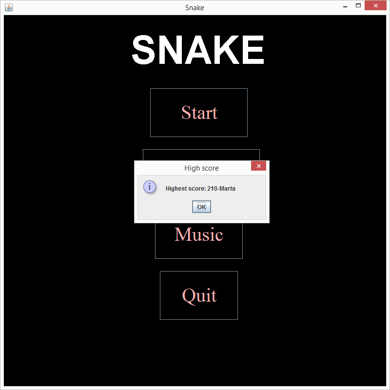

# Snake with Mozart
Simple snake variation implemented in Java.

## Technologies
* Java
* Swing

## Features 
* High score save
* Music choice
* Game pausing

## Installation
```git
git clone https://github.com/maciekpop/dotNetJava.git 
cd dotNetJava/
cd JavaProjekt/
cd Snake/
run application
```

## Views from app






## Instructions
* Moving: WSAD
* Pausing: Space
* Getting back to Menu: Esc


## Authors:
* Maciej Popieluch [@Github](https://github.com/maciekpop)
* Robert Krzyżoś [@Github](https://github.com/CrossAxis98)
